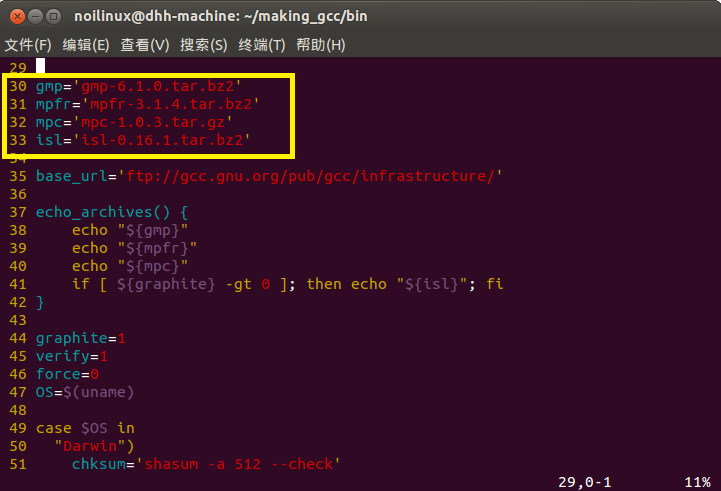
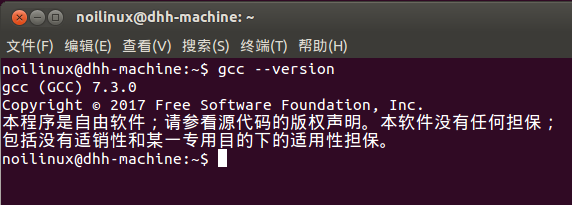

# 编译安装GCC

## 下载GCC及其依赖的源码

### GCC源码

可以在 [官网](ftp://ftp.gnu.org/gnu/gcc/gcc-7.3.0/gcc-7.3.0.tar.gz) ，也可以找 [国内镜像源（清华大学开源软件镜像站）](https://mirrors.tuna.tsinghua.edu.cn/gnu/gcc/gcc-7.3.0/gcc-7.3.0.tar.gz) 下载。

### 依赖包

解压GCC源码。`tar -zxvf gcc-7.3.0.tar.gz` ，进入目录 `cd gcc-7.3.0/contrib/`，查看文件 `vi download_prerequisites`，找到30-32行，查看依赖的版本号



```sh
gmp='gmp-6.1.0.tar.bz2'
mpfr='mpfr-3.1.4.tar.bz2'
mpc='mpc-1.0.3.tar.gz'
```

然后在 [网站](https://gcc.gnu.org/pub/gcc/infrastructure/) 下载指定版本依赖

把gmp-6.1.0, mpfr-3.1.4, mpc-1.0.3压缩包解压到gcc源目录并建立软连接

```bash
tar -xjf gmp-6.1.0.tar.bz2
tar -xjf mpfr-3.1.4.tar.bz2
tar -xzf mpc-1.0.3.tar.gz
ln -fs gmp-6.1.0 gmp
ln -fs mpc-1.0.3 mpc
ln -fs mpfr-3.1.4 mpfr
```

## 编译安装

返回gcc源目录，执行以下命令，生成makefile，编译，将文件复制到指定目录

```bash
./configure --prefix=/home/dhh/gcc-7.3.0 --enable-checking=release --enable-languages=c,c++ --disable-multilib
make -j$(nproc)
make install
```

> `--prefix` 指定安装的目录，要选择有写权限的目录，否则安装不了。
>
> `--enable-checking=release` 对代码进行一致性检查。
>
> `–-enable-languages=c,c++` 支持的高级语言类型和运行时库。
>
> `–-disable-multilib` 生成多个系统版本的代码。

然后就是满屏幕滚动的代码

## 设置环境变量PATH

修改 `~/.bashrc` 文件，在文件末尾添加

```sh
export PATH=/home/dhh/gcc-7.3.0/bin:$PATH
```

执行 `source ~/.bashrc`，使修改生效。再次执行 `gcc --version`，显示的是7.3.0

